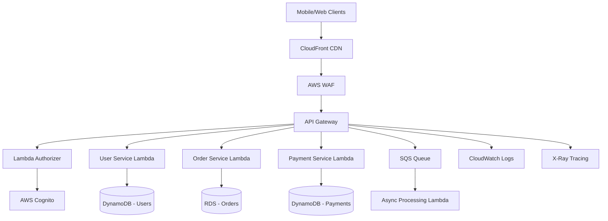

# Amazon API Gateway Integration Guide
## Enterprise Implementation Specification v2.3

**Document Classification:** Internal Technical Specification  
**Last Updated:** December 2024  
**Document Owner:** Cloud Architecture Team  
**Stakeholders:** Backend Engineers, DevOps, Security Team  

---

## Table of Contents

1. [Executive Summary](#executive-summary)
2. [Architecture Overview](#architecture-overview)
3. [Authentication & Authorization](#authentication--authorization)
4. [API Gateway Configuration](#api-gateway-configuration)
5. [Lambda Integration Patterns](#lambda-integration-patterns)
6. [Security & Compliance](#security--compliance)
7. [Rate Limiting & Throttling](#rate-limiting--throttling)
8. [Monitoring & Observability](#monitoring--observability)
9. [Error Handling & Resilience](#error-handling--resilience)
10. [Deployment & CI/CD](#deployment--cicd)
11. [Cost Optimization](#cost-optimization)
12. [Troubleshooting Guide](#troubleshooting-guide)

---

## 1. Executive Summary

### Business Context

Our organization is migrating from a legacy monolithic API server to a modern serverless architecture using Amazon API Gateway and Lambda functions. This migration supports:

- **Scale Requirements**: Handle 10,000+ requests per second during peak hours
- **Global Distribution**: Support users across 15+ geographic regions
- **Compliance**: SOC2, PCI DSS, and GDPR requirements
- **Cost Efficiency**: Reduce infrastructure costs by 40%
- **Developer Velocity**: Enable independent team deployments

### Critical Success Factors

1. **Zero-Downtime Migration**: Maintain 99.99% uptime during transition
2. **Security First**: Implement OAuth 2.0/OIDC with multi-factor authentication
3. **Performance**: Sub-200ms response times for 95th percentile
4. **Observability**: Full request tracing and comprehensive metrics
5. **Cost Control**: Implement request-based pricing with budget alerts

---

## 2. Architecture Overview

### High-Level System Design



### Service Boundaries

| **Service** | **Responsibility** | **Data Store** | **SLA** |
|-------------|-------------------|----------------|---------|
| User Service | User management, profiles, preferences | DynamoDB | 99.9% |
| Order Service | Order processing, inventory management | RDS PostgreSQL | 99.95% |
| Payment Service | Payment processing, billing | DynamoDB + Stripe | 99.99% |
| Notification Service | Email, SMS, push notifications | SQS + SNS | 99.5% |
| Analytics Service | Usage metrics, business intelligence | Kinesis + S3 | 99.0% |

### Integration Patterns

**Synchronous Patterns:**
- REST API calls for real-time operations
- Lambda proxy integration for direct function invocation
- VPC Link for private resource access

**Asynchronous Patterns:**
- SQS queues for decoupled processing
- EventBridge for event-driven architecture
- Step Functions for complex workflows

---

## 3. Authentication & Authorization

### OAuth 2.0 Implementation with AWS Cognito

#### User Pool Configuration

**Required Settings:**
- **Password Policy**: Minimum 12 characters, mixed case, numbers, symbols
- **MFA**: TOTP required for all users, SMS backup
- **Account Recovery**: Email verification with 24-hour token expiry
- **User Attributes**: email (required), phone_number (optional), custom:tenant_id

#### Cognito User Pool Schema

```json
{
  "UserPoolId": "us-east-1_XXXXXXXXX",
  "Attributes": [
    {
      "Name": "email",
      "AttributeDataType": "String",
      "Required": true,
      "Mutable": true
    },
    {
      "Name": "custom:tenant_id",
      "AttributeDataType": "String",
      "Required": true,
      "Mutable": false
    },
    {
      "Name": "custom:role",
      "AttributeDataType": "String",
      "Required": true,
      "Mutable": true
    }
  ]
}
```

#### JWT Token Structure

**Access Token Claims:**
```json
{
  "sub": "user-uuid-here",
  "aud": "client-id",
  "iss": "https://cognito-idp.us-east-1.amazonaws.com/us-east-1_XXXXXXXXX",
  "exp": 1735689600,
  "iat": 1735686000,
  "token_use": "access",
  "scope": "openid profile email",
  "custom:tenant_id": "tenant-123",
  "custom:role": "admin",
  "cognito:groups": ["Administrators", "PowerUsers"]
}
```

#### Lambda Authorizer Implementation

**Authorization Flow:**
1. API Gateway receives request with `Authorization: Bearer <token>`
2. Lambda Authorizer validates JWT signature against Cognito public keys
3. Authorizer checks token expiration and audience
4. Custom authorization logic validates user permissions
5. Return IAM policy allowing/denying specific API operations

**Required Permissions Matrix:**

| **Role** | **Users API** | **Orders API** | **Payments API** | **Admin API** |
|----------|---------------|----------------|------------------|---------------|
| Guest | READ (own) | - | - | - |
| User | READ/WRITE (own) | READ/WRITE (own) | READ (own) | - |
| Moderator | READ (all) | READ/WRITE (all) | READ (all) | READ |
| Admin | FULL | FULL | FULL | FULL |

#### Multi-Tenant Security Model

**Tenant Isolation Requirements:**
- All API operations must include tenant context
- Database queries must filter by tenant_id
- File storage must use tenant-specific S3 prefixes
- Logs must include tenant_id for security auditing

**Implementation Pattern:**
```python
def authorize_request(event, context):
    token = extract_bearer_token(event['headers'])
    claims = validate_jwt_token(token)
    
    tenant_id = claims.get('custom:tenant_id')
    user_role = claims.get('custom:role')
    
    # Tenant-specific authorization logic
    if not is_user_authorized_for_tenant(claims['sub'], tenant_id):
        return generate_deny_policy()
    
    # Resource-specific authorization
    resource_arn = event['methodArn']
    if not check_resource_permissions(user_role, resource_arn):
        return generate_deny_policy()
    
    return generate_allow_policy(claims, tenant_id)
```

---

## 4. API Gateway Configuration

### REST API vs HTTP API Decision Matrix

| **Factor** | **REST API** | **HTTP API** | **Our Choice** |
|------------|--------------|--------------|----------------|
| WebSocket Support | ❌ | ✅ | HTTP API |
| Custom Authorizers | ✅ | ✅ | Both |
| Request Validation | ✅ | Limited | REST API |
| Cost | Higher | 70% cheaper | HTTP API |
| Caching | ✅ | ❌ | REST API |

**Decision**: Use **HTTP API** for new services, **REST API** for legacy compatibility

### Stage Configuration

#### Development Stage
```yaml
StageName: dev
Variables:
  LAMBDA_ALIAS: dev
  LOG_LEVEL: DEBUG
  CORS_ORIGINS: "http://localhost:3000,https://dev.example.com"
Throttling:
  BurstLimit: 100
  RateLimit: 50
```

#### Production Stage
```yaml
StageName: prod
Variables:
  LAMBDA_ALIAS: live
  LOG_LEVEL: WARN
  CORS_ORIGINS: "https://app.example.com,https://api.example.com"
Throttling:
  BurstLimit: 5000
  RateLimit: 2000
```

### Custom Domain Configuration

**Requirements:**
- Primary Domain: `api.example.com`
- Regional Endpoint: Lower latency for US East Coast users
- TLS 1.2+ Only: Security compliance requirement
- Certificate: AWS Certificate Manager with auto-renewal

**DNS Configuration:**
```
api.example.com     CNAME   d-xxxxxxxxxx.execute-api.us-east-1.amazonaws.com
api-eu.example.com  CNAME   d-yyyyyyyyyy.execute-api.eu-west-1.amazonaws.com
api-ap.example.com  CNAME   d-zzzzzzzzzz.execute-api.ap-southeast-1.amazonaws.com
```

### Request/Response Transformation

#### Input Validation Schema

**User Creation Request:**
```json
{
  "$schema": "http://json-schema.org/draft-04/schema#",
  "type": "object",
  "properties": {
    "email": {
      "type": "string",
      "format": "email",
      "maxLength": 254
    },
    "firstName": {
      "type": "string",
      "minLength": 1,
      "maxLength": 50,
      "pattern": "^[a-zA-Z\\s]+$"
    },
    "lastName": {
      "type": "string",
      "minLength": 1,
      "maxLength": 50,
      "pattern": "^[a-zA-Z\\s]+$"
    },
    "phoneNumber": {
      "type": "string",
      "pattern": "^\\+[1-9]\\d{1,14}$"
    }
  },
  "required": ["email", "firstName", "lastName"],
  "additionalProperties": false
}
```

#### Response Transformation

**Success Response Template:**
```json
{
  "success": true,
  "data": $input.json('$'),
  "timestamp": "$context.requestTime",
  "requestId": "$context.requestId"
}
```

**Error Response Template:**
```json
{
  "success": false,
  "error": {
    "code": "$input.path('$.errorType')",
    "message": "$input.path('$.errorMessage')",
    "details": $input.json('$.details')
  },
  "timestamp": "$context.requestTime",
  "requestId": "$context.requestId"
}
```

---

## 5. Lambda Integration Patterns

### Proxy Integration (Recommended)

**Benefits:**
- Full control over request/response
- Access to all HTTP headers and parameters
- Simplified error handling
- Better debugging capabilities

**Lambda Function Structure:**
```python
import json
import boto3
from typing import Dict, Any

def lambda_handler(event: Dict[str, Any], context: Any) -> Dict[str, Any]:
    """
    API Gateway Lambda Proxy Integration Handler
    """
    
    # Extract request information
    http_method = event['httpMethod']
    path = event['path']
    headers = event['headers']
    query_params = event.get('queryStringParameters', {}) or {}
    body = event.get('body')
    
    # Authentication context
    authorizer_context = event.get('requestContext', {}).get('authorizer', {})
    user_id = authorizer_context.get('userId')
    tenant_id = authorizer_context.get('tenantId')
    
    try:
        if http_method == 'GET':
            return handle_get_request(path, query_params, user_id, tenant_id)
        elif http_method == 'POST':
            return handle_post_request(path, body, user_id, tenant_id)
        elif http_method == 'PUT':
            return handle_put_request(path, body, user_id, tenant_id)
        elif http_method == 'DELETE':
            return handle_delete_request(path, user_id, tenant_id)
        else:
            return create_error_response(405, "Method Not Allowed")
            
    except ValidationError as e:
        return create_error_response(400, str(e))
    except AuthorizationError as e:
        return create_error_response(403, str(e))
    except NotFoundError as e:
        return create_error_response(404, str(e))
    except Exception as e:
        logger.error(f"Unexpected error: {str(e)}", exc_info=True)
        return create_error_response(500, "Internal Server Error")

def create_success_response(data: Any, status_code: int = 200) -> Dict[str, Any]:
    """Create standardized success response"""
    return {
        'statusCode': status_code,
        'headers': {
            'Content-Type': 'application/json',
            'Access-Control-Allow-Origin': '*',
            'Access-Control-Allow-Headers': 'Content-Type,Authorization',
            'Access-Control-Allow-Methods': 'GET,POST,PUT,DELETE,OPTIONS'
        },
        'body': json.dumps({
            'success': True,
            'data': data,
            'timestamp': datetime.utcnow().isoformat()
        })
    }

def create_error_response(status_code: int, message: str) -> Dict[str, Any]:
    """Create standardized error response"""
    return {
        'statusCode': status_code,
        'headers': {
            'Content-Type': 'application/json',
            'Access-Control-Allow-Origin': '*'
        },
        'body': json.dumps({
            'success': False,
            'error': {
                'code': status_code,
                'message': message
            },
            'timestamp': datetime.utcnow().isoformat()
        })
    }
```

### VPC Integration Requirements

**Use Cases:**
- Access to RDS databases in private subnets
- Integration with on-premises systems via Direct Connect
- Access to ElastiCache clusters
- Internal microservices communication

**VPC Configuration:**
```yaml
VpcConfig:
  SubnetIds:
    - subnet-12345678  # Private subnet AZ-a
    - subnet-87654321  # Private subnet AZ-b
  SecurityGroupIds:
    - sg-lambda-db-access  # Allow port 5432 to RDS
    - sg-lambda-redis      # Allow port 6379 to ElastiCache
```

**Performance Considerations:**
- **Cold Start Penalty**: Additional 500-1000ms for VPC ENI setup
- **Connection Pooling**: Use RDS Proxy for database connections
- **Security Group Rules**: Minimize rules to reduce network overhead

---

## 6. Security & Compliance

### Web Application Firewall (WAF) Rules

**Mandatory Rules:**
1. **SQL Injection Protection**: Block common SQL injection patterns
2. **XSS Protection**: Filter script injection attempts
3. **Rate Limiting**: Maximum 100 requests per minute per IP
4. **Geographic Blocking**: Block traffic from high-risk countries
5. **User Agent Filtering**: Block known malicious bots

**WAF Configuration:**
```json
{
  "Name": "APIGatewayWAF",
  "Rules": [
    {
      "Name": "AWSManagedRulesCommonRuleSet",
      "Priority": 1,
      "Statement": {
        "ManagedRuleGroupStatement": {
          "VendorName": "AWS",
          "Name": "AWSManagedRulesCommonRuleSet"
        }
      }
    },
    {
      "Name": "RateLimitRule",
      "Priority": 2,
      "Statement": {
        "RateBasedStatement": {
          "Limit": 100,
          "AggregateKeyType": "IP"
        }
      }
    }
  ]
}
```

### Data Encryption Requirements

**In Transit:**
- TLS 1.2+ for all API communications
- Certificate pinning for mobile applications
- HSTS headers with 1-year max-age

**At Rest:**
- DynamoDB encryption with customer-managed KMS keys
- RDS encryption with automated key rotation
- S3 bucket encryption with SSE-KMS

**PII Data Handling:**
- Credit card data: PCI DSS Level 1 compliance
- Personal information: GDPR Article 25 (data protection by design)
- Health data: HIPAA compliance where applicable

### API Security Headers

**Required Headers for All Responses:**
```http
Strict-Transport-Security: max-age=31536000; includeSubDomains
X-Content-Type-Options: nosniff
X-Frame-Options: DENY
X-XSS-Protection: 1; mode=block
Content-Security-Policy: default-src 'self'
Referrer-Policy: strict-origin-when-cross-origin
```

---

## 7. Rate Limiting & Throttling

### API Gateway Throttling Strategy

**Global Throttling Limits:**
- **Production**: 10,000 requests per second burst, 5,000 steady state
- **Development**: 100 requests per second burst, 50 steady state
- **Testing**: 500 requests per second burst, 200 steady state

**Per-Client Throttling:**
```yaml
UsagePlans:
  FreeTier:
    Throttle:
      BurstLimit: 10
      RateLimit: 5
    Quota:
      Limit: 1000
      Period: DAY
  
  PremiumTier:
    Throttle:
      BurstLimit: 100
      RateLimit: 50
    Quota:
      Limit: 100000
      Period: DAY
  
  EnterpriseTier:
    Throttle:
      BurstLimit: 1000
      RateLimit: 500
    Quota:
      Limit: 1000000
      Period: DAY
```

### Lambda Concurrency Management

**Reserved Concurrency:**
- **Critical Services**: 500 reserved concurrent executions
- **Standard Services**: 200 reserved concurrent executions
- **Background Tasks**: 50 reserved concurrent executions

**Provisioned Concurrency:**
```yaml
ProvisionedConcurrency:
  UserService: 100  # Always warm for user authentication
  OrderService: 50  # Warm during business hours
  PaymentService: 25  # Warm for payment processing
```

### Custom Rate Limiting Logic

**Redis-Based Rate Limiting:**
```python
import redis
import time
from typing import Tuple

class RateLimiter:
    def __init__(self, redis_client: redis.Redis):
        self.redis = redis_client
    
    def is_allowed(self, key: str, limit: int, window: int) -> Tuple[bool, dict]:
        """
        Token bucket rate limiting implementation
        
        Args:
            key: Unique identifier (user_id, ip_address, etc.)
            limit: Maximum requests per window
            window: Time window in seconds
        
        Returns:
            (is_allowed, {remaining: int, reset_time: int})
        """
        pipe = self.redis.pipeline()
        current_time = int(time.time())
        
        # Sliding window log approach
        pipe.zremrangebyscore(key, 0, current_time - window)
        pipe.zcard(key)
        pipe.zadd(key, {str(current_time): current_time})
        pipe.expire(key, window)
        
        results = pipe.execute()
        request_count = results[1]
        
        if request_count < limit:
            remaining = limit - request_count - 1
            reset_time = current_time + window
            return True, {"remaining": remaining, "reset_time": reset_time}
        else:
            remaining = 0
            reset_time = current_time + window
            return False, {"remaining": remaining, "reset_time": reset_time}
```

---

## 8. Monitoring & Observability

### CloudWatch Metrics & Alarms

**Critical Metrics to Monitor:**

| **Metric** | **Threshold** | **Action** |
|------------|---------------|------------|
| 5XX Error Rate | > 1% | Page on-call engineer |
| 4XX Error Rate | > 5% | Slack alert to team |
| Latency P99 | > 2000ms | Email alert |
| Throttling Rate | > 0.1% | Scale up resources |
| Lambda Duration | > 15000ms | Investigate timeout |

**Custom Metrics:**
```python
import boto3
from datetime import datetime

cloudwatch = boto3.client('cloudwatch')

def publish_business_metric(metric_name: str, value: float, unit: str = 'Count'):
    """Publish custom business metrics to CloudWatch"""
    cloudwatch.put_metric_data(
        Namespace='BusinessMetrics/API',
        MetricData=[
            {
                'MetricName': metric_name,
                'Value': value,
                'Unit': unit,
                'Timestamp': datetime.utcnow(),
                'Dimensions': [
                    {
                        'Name': 'Environment',
                        'Value': os.environ.get('STAGE', 'dev')
                    },
                    {
                        'Name': 'Service',
                        'Value': os.environ.get('SERVICE_NAME', 'unknown')
                    }
                ]
            }
        ]
    )

# Usage examples
publish_business_metric('UserRegistrations', 1)
publish_business_metric('OrderValue', 99.99, 'None')
publish_business_metric('PaymentFailures', 1)
```

### X-Ray Distributed Tracing

**Tracing Strategy:**
- **100% Sampling**: All production requests for critical services
- **10% Sampling**: Standard services to reduce costs
- **Custom Segments**: Database queries, external API calls, business logic

**Implementation:**
```python
from aws_xray_sdk.core import xray_recorder
from aws_xray_sdk.core import patch_all

# Patch AWS SDK calls
patch_all()

@xray_recorder.capture('user_creation')
def create_user(user_data: dict) -> dict:
    """Create new user with distributed tracing"""
    
    # Add metadata to trace
    xray_recorder.put_metadata('user_data', {
        'email': user_data['email'],
        'tenant_id': user_data.get('tenant_id')
    })
    
    # Custom subsegment for database operation
    with xray_recorder.in_subsegment('database_insert'):
        xray_recorder.put_annotation('table_name', 'users')
        user = save_user_to_database(user_data)
    
    # Custom subsegment for external API call
    with xray_recorder.in_subsegment('send_welcome_email'):
        send_welcome_email(user['email'])
    
    return user
```

### Structured Logging

**Log Format Standard:**
```json
{
  "timestamp": "2024-12-01T10:30:00.000Z",
  "level": "INFO",
  "service": "user-service",
  "version": "1.2.3",
  "requestId": "abc123-def456-ghi789",
  "userId": "user-uuid-here",
  "tenantId": "tenant-123",
  "message": "User created successfully",
  "data": {
    "email": "user@example.com",
    "executionTime": 234
  },
  "tags": ["user-management", "registration"]
}
```

**Python Logging Configuration:**
```python
import logging
import json
from pythonjsonlogger import jsonlogger

class CustomJsonFormatter(jsonlogger.JsonFormatter):
    def add_fields(self, log_record, record, message_dict):
        super().add_fields(log_record, record, message_dict)
        
        # Add standard fields
        log_record['timestamp'] = datetime.utcnow().isoformat()
        log_record['service'] = os.environ.get('SERVICE_NAME', 'unknown')
        log_record['version'] = os.environ.get('SERVICE_VERSION', '1.0.0')
        
        # Add request context if available
        if hasattr(record, 'request_id'):
            log_record['requestId'] = record.request_id
        if hasattr(record, 'user_id'):
            log_record['userId'] = record.user_id
        if hasattr(record, 'tenant_id'):
            log_record['tenantId'] = record.tenant_id

# Configure logger
logger = logging.getLogger()
logger.setLevel(logging.INFO)

handler = logging.StreamHandler()
formatter = CustomJsonFormatter('%(timestamp)s %(level)s %(message)s')
handler.setFormatter(formatter)
logger.addHandler(handler)
```

---

## 9. Error Handling & Resilience

### Error Response Standards

**HTTP Status Code Usage:**

| **Status Code** | **Usage** | **Response Format** |
|-----------------|-----------|-------------------|
| 200 | Success | Standard success response |
| 201 | Resource created | Success with location header |
| 400 | Client error (validation) | Error with field details |
| 401 | Authentication required | Error with auth instructions |
| 403 | Forbidden | Error with permission details |
| 404 | Resource not found | Error with resource info |
| 409 | Conflict | Error with conflict details |
| 429 | Rate limited | Error with retry information |
| 500 | Internal server error | Generic error message |
| 502 | Bad gateway | External service error |
| 503 | Service unavailable | Temporary unavailability |

### Retry Logic & Circuit Breakers

**Exponential Backoff Strategy:**
```python
import time
import random
from typing import Callable, Any

def exponential_backoff_retry(
    func: Callable,
    max_retries: int = 3,
    base_delay: float = 1.0,
    max_delay: float = 60.0,
    exponential_base: float = 2.0,
    jitter: bool = True
) -> Any:
    """
    Exponential backoff retry with optional jitter
    """
    for attempt in range(max_retries + 1):
        try:
            return func()
        except Exception as e:
            if attempt == max_retries:
                raise e
            
            # Calculate delay with exponential backoff
            delay = min(base_delay * (exponential_base ** attempt), max_delay)
            
            # Add jitter to prevent thundering herd
            if jitter:
                delay *= (0.5 + random.random() * 0.5)
            
            logger.warning(f"Attempt {attempt + 1} failed, retrying in {delay:.2f}s: {str(e)}")
            time.sleep(delay)
```

**Circuit Breaker Pattern:**
```python
import time
from enum import Enum
from dataclasses import dataclass
from typing import Callable, Any

class CircuitState(Enum):
    CLOSED = "closed"
    OPEN = "open"
    HALF_OPEN = "half_open"

@dataclass
class CircuitBreakerConfig:
    failure_threshold: int = 5
    success_threshold: int = 3
    timeout: int = 60  # seconds

class CircuitBreaker:
    def __init__(self, config: CircuitBreakerConfig):
        self.config = config
        self.state = CircuitState.CLOSED
        self.failure_count = 0
        self.success_count = 0
        self.last_failure_time = None
    
    def call(self, func: Callable, *args, **kwargs) -> Any:
        """Execute function with circuit breaker protection"""
        
        if self.state == CircuitState.OPEN:
            if self._should_attempt_reset():
                self.state = CircuitState.HALF_OPEN
                logger.info("Circuit breaker moving to HALF_OPEN state")
            else:
                raise CircuitBreakerOpenError("Circuit breaker is OPEN")
        
        try:
            result = func(*args, **kwargs)
            self._on_success()
            return result
        except Exception as e:
            self._on_failure()
            raise e
    
    def _on_success(self):
        """Handle successful function execution"""
        if self.state == CircuitState.HALF_OPEN:
            self.success_count += 1
            if self.success_count >= self.config.success_threshold:
                self.state = CircuitState.CLOSED
                self.failure_count = 0
                self.success_count = 0
                logger.info("Circuit breaker reset to CLOSED state")
        else:
            self.failure_count = 0
    
    def _on_failure(self):
        """Handle failed function execution"""
        self.failure_count += 1
        self.last_failure_time = time.time()
        
        if self.failure_count >= self.config.failure_threshold:
            self.state = CircuitState.OPEN
            logger.warning(f"Circuit breaker opened after {self.failure_count} failures")
    
    def _should_attempt_reset(self) -> bool:
        """Check if circuit should attempt to reset"""
        return (
            self.last_failure_time and
            time.time() - self.last_failure_time >= self.config.timeout
        )
```

### Dead Letter Queue Configuration

**SQS DLQ Setup:**
```yaml
DeadLetterQueue:
  Type: AWS::SQS::Queue
  Properties:
    QueueName: !Sub "${ServiceName}-dlq"
    MessageRetentionPeriod: 1209600  # 14 days
    VisibilityTimeoutSeconds: 60

MainQueue:
  Type: AWS::SQS::Queue
  Properties:
    QueueName: !Sub "${ServiceName}-main"
    RedrivePolicy:
      deadLetterTargetArn: !GetAtt DeadLetterQueue.Arn
      maxReceiveCount: 3
```

**DLQ Processing Lambda:**
```python
def process_dead_letter_messages(event, context):
    """Process messages from Dead Letter Queue for analysis and potential reprocessing"""
    
    for record in event['Records']:
        message_body = json.loads(record['body'])
        
        # Log the failure for analysis
        logger.error("Processing dead letter message", extra={
            'original_message': message_body,
            'failure_count': record.get('attributes', {}).get('ApproximateReceiveCount', 'unknown'),
            'message_id': record.get('messageId')
        })
        
        # Attempt to identify failure reason
        failure_reason = analyze_failure_reason(message_body)
        
        # Store in failure analysis table for manual review
        save_failure_analysis({
            'message_id': record.get('messageId'),
            'message_body': message_body,
            'failure_reason': failure_reason,
            'timestamp': datetime.utcnow().isoformat()
        })
        
        # Alert operations team for critical failures
        if is_critical_failure(failure_reason):
            send_alert_to_ops_team(message_body, failure_reason)
```

---

## 10. Deployment & CI/CD

### Infrastructure as Code (CloudFormation)

**Template Structure:**
```yaml
AWSTemplateFormatVersion: '2010-09-09'
Transform: AWS::Serverless-2016-10-31

Parameters:
  Stage:
    Type: String
    Default: dev
    AllowedValues: [dev, staging, prod]
  
  ServiceName:
    Type: String
    Default: user-service

Globals:
  Function:
    Runtime: python3.9
    Timeout: 30
    MemorySize: 512
    Environment:
      Variables:
        STAGE: !Ref Stage
        LOG_LEVEL: !If [IsProd, WARN, DEBUG]

Conditions:
  IsProd: !Equals [!Ref Stage, prod]

Resources:
  # API Gateway
  ApiGateway:
    Type: AWS::Serverless::HttpApi
    Properties:
      StageName: !Ref Stage
      CorsConfiguration:
        AllowCredentials: true
        AllowHeaders:
          - Content-Type
          - Authorization
        AllowMethods:
          - GET
          - POST
          - PUT
          - DELETE
          - OPTIONS
        AllowOrigins:
          - !If [IsProd, "https://app.example.com", "*"]
      
      # JWT Authorizer
      Auth:
        Authorizers:
          CognitoAuthorizer:
            JwtConfiguration:
              issuer: !Sub "https://cognito-idp.${AWS::Region}.amazonaws.com/${UserPool}"
              audience:
                - !Ref UserPoolClient
        DefaultAuthorizer: CognitoAuthorizer

  # Lambda Functions
  UserFunction:
    Type: AWS::Serverless::Function
    Properties:
      CodeUri: src/
      Handler: user_handler.lambda_handler
      Environment:
        Variables:
          USER_TABLE: !Ref UserTable
      Events:
        GetUser:
          Type: HttpApi
          Properties:
            ApiId: !Ref ApiGateway
            Method: GET
            Path: /users/{userId}
        CreateUser:
          Type: HttpApi
          Properties:
            ApiId: !Ref ApiGateway
            Method: POST
            Path: /users

  # DynamoDB Table
  UserTable:
    Type: AWS::DynamoDB::Table
    Properties:
      TableName: !Sub "${ServiceName}-users-${Stage}"
      BillingMode: PAY_PER_REQUEST
      AttributeDefinitions:
        - AttributeName: userId
          AttributeType: S
        - AttributeName: email
          AttributeType: S
      KeySchema:
        - AttributeName: userId
          KeyType: HASH
      GlobalSecondaryIndexes:
        - IndexName: EmailIndex
          KeySchema:
            - AttributeName: email
              KeyType: HASH
          Projection:
            ProjectionType: ALL
```

### CI/CD Pipeline (GitHub Actions)

**Pipeline Configuration (.github/workflows/deploy.yml):**
```yaml
name: Deploy API Gateway Service

on:
  push:
    branches: [main, develop]
  pull_request:
    branches: [main]

env:
  AWS_REGION: us-east-1

jobs:
  test:
    runs-on: ubuntu-latest
    steps:
      - uses: actions/checkout@v3
      
      - name: Set up Python
        uses: actions/setup-python@v4
        with:
          python-version: '3.9'
      
      - name: Install dependencies
        run: |
          pip install -r requirements.txt
          pip install -r requirements-dev.txt
      
      - name: Run unit tests
        run: pytest tests/unit/ -v --cov=src --cov-report=xml
      
      - name: Run integration tests
        run: pytest tests/integration/ -v
      
      - name: Upload coverage to Codecov
        uses: codecov/codecov-action@v3

  security-scan:
    runs-on: ubuntu-latest
    steps:
      - uses: actions/checkout@v3
      
      - name: Run security scan
        uses: securecodewarrior/github-action-add-sarif@v1
        with:
          sarif-file: 'security-scan-results.sarif'

  deploy-dev:
    if: github.ref == 'refs/heads/develop'
    needs: [test, security-scan]
    runs-on: ubuntu-latest
    steps:
      - uses: actions/checkout@v3
      
      - name: Configure AWS credentials
        uses: aws-actions/configure-aws-credentials@v2
        with:
          aws-access-key-id: ${{ secrets.AWS_ACCESS_KEY_ID }}
          aws-secret-access-key: ${{ secrets.AWS_SECRET_ACCESS_KEY }}
          aws-region: ${{ env.AWS_REGION }}
      
      - name: Deploy to dev
        run: |
          sam build
          sam deploy --config-env dev --no-confirm-changeset

  deploy-prod:
    if: github.ref == 'refs/heads/main'
    needs: [test, security-scan]
    runs-on: ubuntu-latest
    environment: production
    steps:
      - uses: actions/checkout@v3
      
      - name: Configure AWS credentials
        uses: aws-actions/configure-aws-credentials@v2
        with:
          aws-access-key-id: ${{ secrets.AWS_ACCESS_KEY_ID_PROD }}
          aws-secret-access-key: ${{ secrets.AWS_SECRET_ACCESS_KEY_PROD }}
          aws-region: ${{ env.AWS_REGION }}
      
      - name: Deploy to production
        run: |
          sam build
          sam deploy --config-env prod --no-confirm-changeset
```

### Blue/Green Deployment Strategy

**Lambda Alias Configuration:**
```yaml
UserFunctionAlias:
  Type: AWS::Lambda::Alias
  Properties:
    FunctionName: !Ref UserFunction
    FunctionVersion: !GetAtt UserFunctionVersion.Version
    Name: live
    RoutingConfig:
      AdditionalVersionWeights:
        - FunctionVersion: !GetAtt UserFunctionNewVersion.Version
          FunctionWeight: 0.1  # 10% traffic to new version

UserFunctionVersion:
  Type: AWS::Lambda::Version
  Properties:
    FunctionName: !Ref UserFunction

UserFunctionNewVersion:
  Type: AWS::Lambda::Version
  Properties:
    FunctionName: !Ref UserFunction
    CodeSha256: !GetAtt UserFunction.CodeSha256
```

**Automated Rollback Trigger:**
```python
def check_deployment_health(function_name: str, alias: str) -> bool:
    """Check if deployment is healthy and decide on rollback"""
    
    cloudwatch = boto3.client('cloudwatch')
    lambda_client = boto3.client('lambda')
    
    # Check error rate over last 5 minutes
    end_time = datetime.utcnow()
    start_time = end_time - timedelta(minutes=5)
    
    response = cloudwatch.get_metric_statistics(
        Namespace='AWS/Lambda',
        MetricName='Errors',
        Dimensions=[
            {'Name': 'FunctionName', 'Value': function_name},
            {'Name': 'Resource', 'Value': f"{function_name}:{alias}"}
        ],
        StartTime=start_time,
        EndTime=end_time,
        Period=300,
        Statistics=['Sum']
    )
    
    total_errors = sum(point['Sum'] for point in response['Datapoints'])
    
    # If error rate > 5%, trigger rollback
    if total_errors > 5:
        logger.error(f"High error rate detected: {total_errors} errors in 5 minutes")
        trigger_rollback(function_name, alias)
        return False
    
    return True

def trigger_rollback(function_name: str, alias: str):
    """Rollback to previous version"""
    lambda_client = boto3.client('lambda')
    
    # Set routing config to 100% previous version
    lambda_client.update_alias(
        FunctionName=function_name,
        Name=alias,
        RoutingConfig={
            'AdditionalVersionWeights': {}  # Remove traffic from new version
        }
    )
    
    # Send alert to operations team
    send_alert("Automatic rollback triggered", {
        'function': function_name,
        'alias': alias,
        'reason': 'High error rate'
    })
```

---

## 11. Cost Optimization

### API Gateway Pricing Model

**Request Pricing (HTTP API):**
- First 300 million requests/month: $1.00 per million
- Next 700 million requests/month: $0.90 per million
- Over 1 billion requests/month: $0.80 per million

**Data Transfer Pricing:**
- First 1 GB/month: Free
- Up to 10 TB/month: $0.09 per GB
- Over 10 TB/month: $0.085 per GB

**Cost Estimation Calculator:**
```python
def calculate_monthly_api_cost(
    requests_per_month: int,
    avg_response_size_kb: float,
    cache_hit_ratio: float = 0.0
) -> dict:
    """Calculate estimated monthly API Gateway costs"""
    
    # Request costs (HTTP API pricing)
    if requests_per_month <= 300_000_000:
        request_cost = requests_per_month * 1.00 / 1_000_000
    elif requests_per_month <= 1_000_000_000:
        request_cost = (300_000_000 * 1.00 / 1_000_000) + \
                      ((requests_per_month - 300_000_000) * 0.90 / 1_000_000)
    else:
        request_cost = (300_000_000 * 1.00 / 1_000_000) + \
                      (700_000_000 * 0.90 / 1_000_000) + \
                      ((requests_per_month - 1_000_000_000) * 0.80 / 1_000_000)
    
    # Data transfer costs
    effective_requests = requests_per_month * (1 - cache_hit_ratio)
    total_data_gb = (effective_requests * avg_response_size_kb) / (1024 * 1024)
    
    if total_data_gb <= 1:
        data_cost = 0
    elif total_data_gb <= 10_240:  # 10 TB
        data_cost = (total_data_gb - 1) * 0.09
    else:
        data_cost = (10_239 * 0.09) + ((total_data_gb - 10_240) * 0.085)
    
    return {
        'request_cost': round(request_cost, 2),
        'data_transfer_cost': round(data_cost, 2),
        'total_cost': round(request_cost + data_cost, 2),
        'cost_per_million_requests': round((request_cost + data_cost) / (requests_per_month / 1_000_000), 2)
    }

# Example usage
monthly_cost = calculate_monthly_api_cost(
    requests_per_month=50_000_000,  # 50M requests
    avg_response_size_kb=2.5,       # 2.5KB average response
    cache_hit_ratio=0.3             # 30% cache hit rate
)
print(f"Estimated monthly cost: ${monthly_cost['total_cost']}")
```

### Lambda Cost Optimization

**Memory vs Duration Trade-off:**
```python
def optimize_lambda_memory():
    """
    Memory optimization analysis for Lambda functions
    Based on AWS Lambda Power Tuning tool results
    """
    
    # Cost analysis for different memory configurations
    memory_configs = [
        {'memory': 128, 'duration': 5000, 'price_per_gb_second': 0.0000166667},
        {'memory': 256, 'duration': 2500, 'price_per_gb_second': 0.0000166667},
        {'memory': 512, 'duration': 1250, 'price_per_gb_second': 0.0000166667},
        {'memory': 1024, 'duration': 625, 'price_per_gb_second': 0.0000166667},
        {'memory': 2048, 'duration': 312, 'price_per_gb_second': 0.0000166667},
    ]
    
    for config in memory_configs:
        gb_seconds = (config['memory'] / 1024) * (config['duration'] / 1000)
        cost_per_execution = gb_seconds * config['price_per_gb_second']
        
        print(f"Memory: {config['memory']}MB, "
              f"Duration: {config['duration']}ms, "
              f"Cost: ${cost_per_execution:.6f} per execution")

# Recommended configuration based on analysis:
# 512MB memory provides optimal cost/performance ratio for most workloads
```

### Caching Strategy

**CloudFront + API Gateway Caching:**
```yaml
CachePolicy:
  Type: AWS::CloudFront::CachePolicy
  Properties:
    CachePolicyConfig:
      Name: APICachePolicy
      DefaultTTL: 300  # 5 minutes
      MaxTTL: 3600     # 1 hour
      MinTTL: 0
      ParametersInCacheKeyAndForwardedToOrigin:
        EnableAcceptEncodingGzip: true
        EnableAcceptEncodingBrotli: true
        QueryStringsConfig:
          QueryStringBehavior: whitelist
          QueryStrings:
            - limit
            - offset
            - filter
        HeadersConfig:
          HeaderBehavior: whitelist
          Headers:
            - Authorization
            - Accept
```

**Redis Caching Implementation:**
```python
import redis
import json
import hashlib
from typing import Optional, Any

class APICache:
    def __init__(self, redis_url: str, default_ttl: int = 300):
        self.redis = redis.from_url(redis_url)
        self.default_ttl = default_ttl
    
    def get_cache_key(self, endpoint: str, params: dict, user_context: dict) -> str:
        """Generate cache key based on endpoint, parameters, and user context"""
        cache_data = {
            'endpoint': endpoint,
            'params': sorted(params.items()),
            'user_tenant': user_context.get('tenant_id'),
            'user_role': user_context.get('role')
        }
        
        cache_string = json.dumps(cache_data, sort_keys=True)
        return f"api_cache:{hashlib.md5(cache_string.encode()).hexdigest()}"
    
    def get(self, endpoint: str, params: dict, user_context: dict) -> Optional[Any]:
        """Retrieve cached response"""
        cache_key = self.get_cache_key(endpoint, params, user_context)
        
        try:
            cached_data = self.redis.get(cache_key)
            if cached_data:
                return json.loads(cached_data)
        except Exception as e:
            logger.warning(f"Cache retrieval failed: {str(e)}")
        
        return None
    
    def set(self, endpoint: str, params: dict, user_context: dict, data: Any, ttl: Optional[int] = None) -> bool:
        """Cache API response"""
        cache_key = self.get_cache_key(endpoint, params, user_context)
        ttl = ttl or self.default_ttl
        
        try:
            self.redis.setex(cache_key, ttl, json.dumps(data, default=str))
            return True
        except Exception as e:
            logger.warning(f"Cache storage failed: {str(e)}")
            return False
    
    def invalidate_pattern(self, pattern: str):
        """Invalidate cache entries matching pattern"""
        try:
            keys = self.redis.keys(f"api_cache:*{pattern}*")
            if keys:
                self.redis.delete(*keys)
                logger.info(f"Invalidated {len(keys)} cache entries matching pattern: {pattern}")
        except Exception as e:
            logger.error(f"Cache invalidation failed: {str(e)}")
```

---

## 12. Troubleshooting Guide

### Common Issues & Solutions

#### 1. High Latency Issues

**Symptoms:**
- P99 latency > 2000ms
- Timeout errors in CloudWatch
- User complaints about slow responses

**Diagnostic Steps:**
```python
def diagnose_latency_issues(function_name: str, start_time: datetime, end_time: datetime):
    """Comprehensive latency analysis"""
    
    cloudwatch = boto3.client('cloudwatch')
    
    # Get Lambda duration metrics
    duration_response = cloudwatch.get_metric_statistics(
        Namespace='AWS/Lambda',
        MetricName='Duration',
        Dimensions=[{'Name': 'FunctionName', 'Value': function_name}],
        StartTime=start_time,
        EndTime=end_time,
        Period=300,
        Statistics=['Average', 'Maximum', 'p99']
    )
    
    # Get API Gateway latency metrics
    integration_latency = cloudwatch.get_metric_statistics(
        Namespace='AWS/ApiGateway',
        MetricName='IntegrationLatency',
        Dimensions=[{'Name': 'ApiName', 'Value': 'your-api-name'}],
        StartTime=start_time,
        EndTime=end_time,
        Period=300,
        Statistics=['Average', 'Maximum', 'p99']
    )
    
    # Analyze X-Ray traces for bottlenecks
    xray = boto3.client('xray')
    traces = xray.get_trace_summaries(
        TimeRangeType='TimeRangeByStartTime',
        StartTime=start_time,
        EndTime=end_time,
        FilterExpression=f'service("{function_name}")'
    )
    
    # Identify slow database queries
    slow_queries = []
    for trace in traces['TraceSummaries']:
        if trace['ResponseTime'] > 1.0:  # > 1 second
            trace_detail = xray.get_trace(TraceIds=[trace['Id']])
            # Analyze segments for database calls
            slow_queries.extend(find_slow_database_calls(trace_detail))
    
    return {
        'lambda_duration': duration_response['Datapoints'],
        'api_gateway_latency': integration_latency['Datapoints'],
        'slow_queries': slow_queries,
        'recommendations': generate_latency_recommendations(duration_response, integration_latency)
    }
```

**Common Solutions:**
- Increase Lambda memory allocation
- Implement connection pooling for databases
- Add CloudFront caching for GET requests
- Optimize database queries and add indexes
- Use RDS Proxy for connection management

#### 2. Authentication Failures

**Symptoms:**
- 401 Unauthorized errors
- JWT token validation failures
- Intermittent authentication issues

**Debugging Script:**
```python
def debug_auth_issues(jwt_token: str):
    """Debug JWT authentication issues"""
    
    try:
        # Decode JWT header without verification
        header = jwt.get_unverified_header(jwt_token)
        payload = jwt.decode(jwt_token, options={"verify_signature": False})
        
        print(f"Token Algorithm: {header.get('alg')}")
        print(f"Token Kid: {header.get('kid')}")
        print(f"Token Issuer: {payload.get('iss')}")
        print(f"Token Audience: {payload.get('aud')}")
        print(f"Token Expiry: {datetime.fromtimestamp(payload.get('exp', 0))}")
        print(f"Current Time: {datetime.utcnow()}")
        
        # Check if token is expired
        if payload.get('exp', 0) < time.time():
            print("❌ Token is expired")
            return False
        
        # Validate issuer
        expected_issuer = f"https://cognito-idp.{os.environ['AWS_REGION']}.amazonaws.com/{os.environ['USER_POOL_ID']}"
        if payload.get('iss') != expected_issuer:
            print(f"❌ Invalid issuer. Expected: {expected_issuer}")
            return False
        
        # Validate audience
        if payload.get('aud') != os.environ['USER_POOL_CLIENT_ID']:
            print(f"❌ Invalid audience. Expected: {os.environ['USER_POOL_CLIENT_ID']}")
            return False
        
        print("✅ Basic token validation passed")
        return True
        
    except Exception as e:
        print(f"❌ Token decoding failed: {str(e)}")
        return False
```

**Solutions:**
- Verify Cognito User Pool configuration
- Check JWT signing keys are up to date
- Validate token audience and issuer
- Implement proper token refresh logic
- Add token validation debugging logs

#### 3. Rate Limiting Errors

**Symptoms:**
- 429 Too Many Requests errors
- Throttling in CloudWatch metrics
- Users unable to access API

**Analysis Script:**
```python
def analyze_rate_limiting(api_id: str, start_time: datetime, end_time: datetime):
    """Analyze rate limiting patterns"""
    
    cloudwatch = boto3.client('cloudwatch')
    
    # Get throttling metrics
    throttle_response = cloudwatch.get_metric_statistics(
        Namespace='AWS/ApiGateway',
        MetricName='ThrottledRequests',
        Dimensions=[{'Name': 'ApiId', 'Value': api_id}],
        StartTime=start_time,
        EndTime=end_time,
        Period=300,
        Statistics=['Sum']
    )
    
    # Get request count metrics
    request_response = cloudwatch.get_metric_statistics(
        Namespace='AWS/ApiGateway',
        MetricName='Count',
        Dimensions=[{'Name': 'ApiId', 'Value': api_id}],
        StartTime=start_time,
        EndTime=end_time,
        Period=300,
        Statistics=['Sum']
    )
    
    # Calculate throttling rate
    for i, throttle_point in enumerate(throttle_response['Datapoints']):
        request_point = request_response['Datapoints'][i]
        throttle_rate = (throttle_point['Sum'] / request_point['Sum']) * 100
        
        print(f"Time: {throttle_point['Timestamp']}")
        print(f"Requests: {request_point['Sum']}")
        print(f"Throttled: {throttle_point['Sum']}")
        print(f"Throttle Rate: {throttle_rate:.2f}%")
        print("---")
    
    return {
        'throttled_requests': throttle_response['Datapoints'],
        'total_requests': request_response['Datapoints']
    }
```

**Solutions:**
- Increase API Gateway throttling limits
- Implement client-side retry with exponential backoff
- Add usage plans for different user tiers
- Implement caching to reduce request volume
- Use SQS queues for non-real-time operations

#### 4. Lambda Cold Start Issues

**Symptoms:**
- High P99 latency
- Timeout errors during low traffic periods
- Variable response times

**Optimization Strategies:**
```python
# Lambda function optimization for cold starts

import json
import boto3
from functools import lru_cache

# Initialize clients outside handler (reused across invocations)
dynamodb = boto3.resource('dynamodb')
table = dynamodb.Table(os.environ['USER_TABLE'])

# Cache configuration and frequently used data
@lru_cache(maxsize=128)
def get_config_value(key: str) -> str:
    """Cache configuration values"""
    ssm = boto3.client('ssm')
    response = ssm.get_parameter(Name=key, WithDecryption=True)
    return response['Parameter']['Value']

# Connection pooling for external services
session = requests.Session()
session.mount('https://', requests.adapters.HTTPAdapter(pool_connections=20, pool_maxsize=20))

def lambda_handler(event, context):
    """Optimized Lambda handler"""
    
    # Minimal imports in handler
    # Heavy processing in separate functions
    # Use connection pooling for external calls
    
    start_time = time.time()
    
    try:
        result = process_request(event)
        
        # Log performance metrics
        execution_time = (time.time() - start_time) * 1000
        logger.info("Request processed", extra={
            'execution_time_ms': execution_time,
            'cold_start': getattr(context, '_cold_start', False)
        })
        
        return create_success_response(result)
    
    except Exception as e:
        logger.error(f"Request failed: {str(e)}", exc_info=True)
        return create_error_response(500, "Internal Server Error")
```

**Solutions:**
- Use provisioned concurrency for critical functions
- Minimize import statements and dependencies
- Implement connection pooling
- Use smaller deployment packages
- Pre-warm functions during deployment

---

## Implementation Checklist

### Pre-Implementation Phase
- [ ] Review AWS account limits and request increases if needed
- [ ] Set up development, staging, and production AWS accounts
- [ ] Configure IAM roles and policies following least privilege principle
- [ ] Set up monitoring and alerting infrastructure
- [ ] Create deployment pipelines and testing frameworks

### Implementation Phase
- [ ] Deploy API Gateway with basic configuration
- [ ] Implement Lambda functions with proper error handling
- [ ] Configure authentication with Cognito User Pools
- [ ] Set up custom domain and SSL certificates
- [ ] Implement rate limiting and throttling controls
- [ ] Add comprehensive logging and monitoring
- [ ] Configure backup and disaster recovery procedures

### Post-Implementation Phase
- [ ] Conduct load testing with production-like traffic
- [ ] Perform security penetration testing
- [ ] Document operational procedures and runbooks
- [ ] Train development and operations teams
- [ ] Monitor system performance and optimize as needed
- [ ] Plan for future scaling and feature additions

---

## Appendix A: API Endpoint Reference

### User Management Endpoints

```
GET    /users/{userId}           # Get user profile
POST   /users                   # Create new user
PUT    /users/{userId}          # Update user profile
DELETE /users/{userId}          # Deactivate user account
GET    /users/{userId}/orders   # Get user's orders
POST   /users/{userId}/avatar   # Upload profile picture
```

### Order Management Endpoints

```
GET    /orders                  # List orders (paginated)
POST   /orders                  # Create new order
GET    /orders/{orderId}        # Get order details
PUT    /orders/{orderId}        # Update order
DELETE /orders/{orderId}        # Cancel order
POST   /orders/{orderId}/ship   # Mark order as shipped
```

### Payment Endpoints

```
POST   /payments               # Process payment
GET    /payments/{paymentId}   # Get payment status
POST   /payments/refund        # Process refund
GET    /billing/history        # Get billing history
```

---

## Appendix B: Security Headers Reference

```http
# Required security headers for all API responses
Strict-Transport-Security: max-age=31536000; includeSubDomains; preload
X-Content-Type-Options: nosniff
X-Frame-Options: DENY
X-XSS-Protection: 1; mode=block
Content-Security-Policy: default-src 'self'; img-src 'self' data: https:; font-src 'self' https:; style-src 'self' 'unsafe-inline' https:; script-src 'self' https:
Referrer-Policy: strict-origin-when-cross-origin
Permissions-Policy: camera=(), microphone=(), geolocation=()
```

---

**Document Version:** 2.3  
**Last Updated:** December 1, 2024  
**Next Review Date:** March 1, 2025  
**Classification:** Internal Technical Specification
